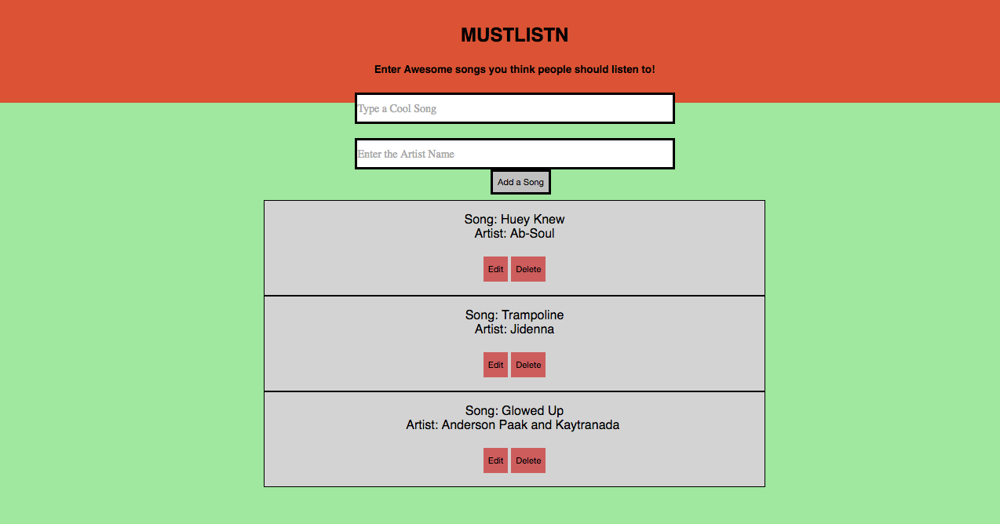

# <center> MUSTLISTN SONG LIST</center>
<br>




## Implementation
As stated in project requirements, I used React and Rails as well as firebase for the database. I created four components App, Input, Songs, and SongFeed. I was able to style in CSS using Flexbox as well as utilizing Google fonts.


## Technologies Used

For this project I used :
- Javascript
- React
- Axios
- HTML
- CSS (Flexbox)


## Code Example from Events Component

```javascript
import React from 'react';
import axios from 'axios';

class Song extends React.Component {
  constructor(){
    super();
    this.state= {
      edit:false
    }
  }
  songDelete(key) {
    axios.delete(`https://mustlistn.firebaseio.com/${key}.json`)
    .then((res) => {this.props.getSongs();
                   this.props.addSong();
                 })
  }

  songEdit(key) {
    this.setState({edit: !this.state.edit})
    axios.patch(`https://mustlistn.firebaseio.com/${key}.json`, {
      song:this.editsong.value,
      artist:this.editartist.value
    })
    .then((res) => {
      this.props.getSongs();
      this.props.addSong();
    })
  }

  editShow() {
    const { songs } =this.props;
    return (
      <div>
      <textarea className="edit-field" ref={(text)=>this.editsong=text} defaultValue={songs[this.props.toShow].song} /><br/>
      <textarea className="edit-field" ref={(text)=>this.editartist=text} defaultValue={songs[this.props.toShow].artist} />
      <br/>
      <button type="submit" onClick={() => this.songEdit(this.props.toShow)} className="flat">
        Save
      </button>
      <button type="submit" className="flat" onClick={()=> this.setState({edit:!this.state.edit})}>
          Cancel
        </button>
      </div>

    )
  }

  normalShow() {
    const { songs } = this.props;
    return (
    <li className="eachLi">
      Song: {songs[this.props.toShow].song}
      <br/>

       Artist: {songs[this.props.toShow].artist}
      <br/>
      <br/>
    <div className="buttons">
      <button type="submit" className="flat" onClick={() => this.songEdit(this.props.toShow)} className="flat">Edit</button>
      <button type="submit" className="flat" onClick={() => this.songDelete(this.props.toShow)} className="flat">Delete</button>
    </div>
  </li>
    )
  }
  render() {
    if(!this.state.edit){
      return (this.normalShow());
    }
    else{
      return (this.editShow());
    }
  }
}


export default Song;


```

## Build Strategy

My strategy was for my project to be a song playlist app, and to fully understand CRUD within rails. The Song component is a child of SongFeed and SongFeed renders in or is a child of App.js. Input component is also a child of App. The data from the input fields in Input is stored via values derived from ref on each field. This is then posted to a Firebase database (via a relevant url) using axios. The data posted is then fetched via axios and passed to the events object, which is stored/set in state within App (getEvents function within App component- Line 30). The edit and delete functions on each event are defined and called in the Songs component, and accessed/referenced via the unique key firebase  assigns each event. This is done by using the map function over the keys of the songs object in state within App. (Refer to Line 42 in App component within addEvent function).Additionally, an edit boolean is set in state within events. When false the event list will render as normal via regDisplay function  if edit is true, it will render the text area fields for all attributes of each event list item. (refer to lines 19,33,52,71 in Events). the edit boolean is changed within eventEdit function and is called on click of the Edit button.


## Contributors
The main contributor is GA and Hakuna Matata, who helped me come up with the logic for this web app, through class work as well as learning from and teaching classmates.

## Complications/Future Improvements

- It was tough syntaxing passing data to database tables in Rails and more importantly to deploy to heroku. I tried to change the query language to the database from sqlite to postgres to deploy to heroku which backfired, so for now I have used firebase. I will properly implement the data passed to tables and deploy to heroku.

- I would like to additional song data from itunes and perhaps stats like no. of downloads, etc.

- Be able to filter or search songs by keywords from the song name, artist, etc.


- I would like to add more dynamic and attractive styling via CSS and Bootstrap, and will look to make those improvements


## Authors

- Karthik Meda
- General Assembly
